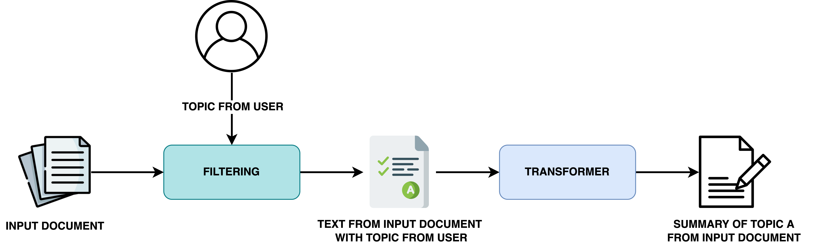

# Qubart: Automatic Text Summarization with Topic Selection
***

Source project for the MS thesis ["Automatic text summarization using a filter-based approach"](https://www.researchgate.net/publication/355339249_Automatic_text_summarization_using_a_filter-based_approach).

</img>

The architecture of QuBART is as follows: 

* **Filtering module**: Given an input document, the contents will be filtered by a certain topic. The topic can be (1) given by the user or (2) selected from the list of identified topics of the input document. The output of this module will be a **selection of paragraphs from the original document that has to do with the selected topic A**. 
* **Transformer module**: The input of this module will be the filtered text from the filtering module. We apply BART to obtain a summary related to topic A from the input document. 

## Using Streamlit 
To run the app, type into the terminal: 
```streamlit run app.py```
